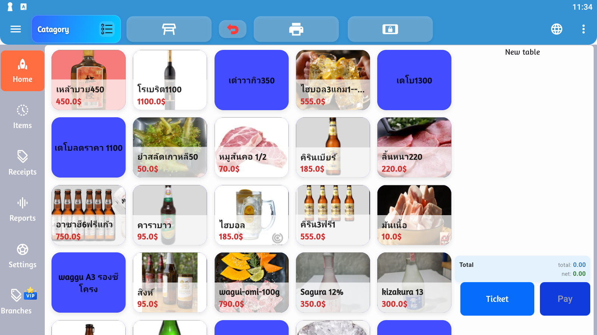

# 📱 คู่มือแอปมือถือ POSTEEYAI

ยินดีต้อนรับสู่คู่มือการใช้งานแอป!

> สำหรับเจ้าของร้านและพนักงานที่ต้องการเรียนรู้การใช้งานระบบ POS แบบง่าย ๆ

---

## 🔹 เริ่มต้นใช้งาน
1. ดาวน์โหลดแอปจาก Play Store
2. เข้าสู่ระบบด้วยบัญชีร้านของคุณ
3. เพิ่มสินค้าและเริ่มขายได้ทันที 🚀

📖 [ดูรายละเอียดเพิ่มเติม](guide/getting-started.md)
