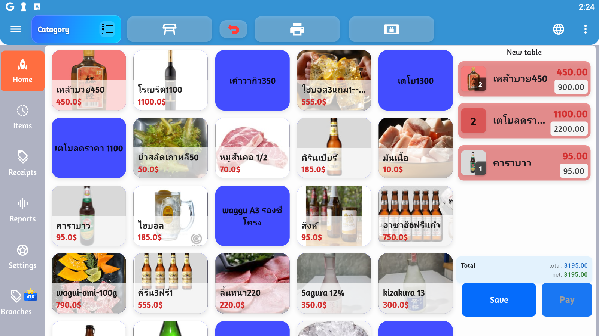

# 🏢 จัดการสาขา (Branches)

การจัดการหลายสาขาอย่างเป็นระบบ เพื่อการควบคุมและติดตามที่มีประสิทธิภาพ



## 📍 ภาพรวมการจัดการสาขา

### ฟีเจอร์หลัก

| ฟีเจอร์ | ไอคอน | คำอธิบาย |
|---------|-------|----------|
| เพิ่มสาขา | ➕ | สร้างสาขาใหม่ |
| แก้ไขสาขา | ✏️ | แก้ไขข้อมูลสาขา |
| โอนสินค้า | 🔄 | โอนสินค้าระหว่างสาขา |
| รายงานแยกสาขา | 📊 | ดูรายงานแต่ละสาขา |
| ซิงค์ข้อมูล | 🔁 | ซิงค์ข้อมูลระหว่างสาขา |

## ➕ การเพิ่มสาขาใหม่

### ขั้นตอนการสร้างสาขา

```
1. เมนู > Branches > Add Branch
2. กรอกข้อมูลสาขา
3. ตั้งค่าเริ่มต้น
4. เพิ่มผู้ใช้
5. บันทึก
```

### ข้อมูลที่ต้องกรอก

**ข้อมูลพื้นฐาน**
```
รหัสสาขา: BR001 (ไม่ซ้ำ)
ชื่อสาขา: สาขาสยาม
สถานะ: ⚪ เปิดใช้งาน / ⚫ ปิดใช้งาน
```

**ที่อยู่สาขา**
```
ที่อยู่: 456 ถนนพระราม 1
แขวง: ปทุมวัน
เขต: ปทุมวัน
จังหวัด: กรุงเทพฯ
รหัสไปรษณีย์: 10330
```

**ข้อมูลติดต่อ**
```
โทรศัพท์: 02-234-5678
อีเมล: siam@abccafe.com
ผู้จัดการ: คุณสมหญิง รักงาน
โทรผู้จัดการ: 089-234-5678
```

**พิกัด (ถ้ามี)**
```
Latitude: 13.7465
Longitude: 100.5354
(ใช้สำหรับแผนที่และ Delivery)
```

## ✏️ การจัดการสาขา

### ดูรายการสาขา

```
╔═══════════════════════════════════════════════╗
║  รหัส  │ ชื่อสาขา    │ ผู้จัดการ      │ สถานะ  ║
╠═══════════════════════════════════════════════╣
║ BR001  │ สำนักงานใหญ่ │ คุณสมชาย       │ ✓ เปิด  ║
║ BR002  │ สาขาสยาม    │ คุณสมหญิง      │ ✓ เปิด  ║
║ BR003  │ สาขาเซ็นทรัล │ คุณสมศรี       │ ✓ เปิด  ║
║ BR004  │ สาขาแอร์พอร์ต│ คุณสมพงษ์      │ ⚠ ปิดชั่วคราว ║
╚═══════════════════════════════════════════════╝
```

### การแก้ไขข้อมูลสาขา

```
1. เลือกสาขาที่ต้องการแก้ไข
2. คลิก "Edit" ✏️
3. แก้ไขข้อมูล
4. บันทึก
```

**ข้อมูลที่สามารถแก้ไขได้**
- ✅ ชื่อสาขา
- ✅ ที่อยู่และข้อมูลติดต่อ
- ✅ ผู้จัดการสาขา
- ✅ สถานะ (เปิด/ปิด)
- ⚠️ รหัสสาขา (ควรหลีกเลี่ยง)

### การปิด/เปิดสาขา

**ปิดสาขาชั่วคราว**
```
1. เลือกสาขา
2. คลิก "Disable"
3. ระบุเหตุผล
4. กำหนดวันที่เปิดใหม่ (ถ้ามี)
5. ยืนยัน
```

**ผลของการปิดสาขา**
- ❌ ไม่สามารถขายได้
- 📊 รายงานยังดูได้
- 💾 ข้อมูลยังอยู่
- 🔄 ซิงค์ข้อมูลหยุด

**ปิดสาขาถาวร**
```
⚠️ คำเตือน!
- ย้ายสินค้าออกก่อน
- Export รายงานทั้งหมด
- Backup ข้อมูล
- ยืนยันการปิด
```

## 🔄 การโอนสินค้าระหว่างสาขา

### การสร้างใบโอนสินค้า

**ขั้นตอนการโอน**
```
1. Branches > Transfer > New Transfer
2. เลือกสาขาต้นทาง (From)
3. เลือกสาขาปลายทาง (To)
4. เพิ่มสินค้าที่ต้องการโอน
5. ระบุจำนวน
6. บันทึกใบโอน
7. พิมพ์เอกสารโอน
```

**ใบโอนสินค้า**
```
╔═══════════════════════════════════════════╗
║         ใบโอนสินค้าระหว่างสาขา            ║
╠═══════════════════════════════════════════╣
║ เลขที่: TRF-20250811-001                 ║
║ วันที่: 11 สิงหาคม 2025                   ║
╠═══════════════════════════════════════════╣
║ สาขาต้นทาง: BR001 - สำนักงานใหญ่          ║
║ สาขาปลายทาง: BR002 - สาขาสยาม            ║
╠═══════════════════════════════════════════╣
║ รายการสินค้า:                             ║
║                                           ║
║ 1. น้ำดื่ม 600ml         50 ขวด          ║
║ 2. กาแฟเย็น              30 แก้ว         ║
║ 3. ขนมปัง                20 ชิ้น          ║
╠═══════════════════════════════════════════╣
║ ผู้ส่ง: _________________ วันที่: ______  ║
║ ผู้รับ: _________________ วันที่: ______  ║
╚═══════════════════════════════════════════╝
```

### การรับสินค้า

**ที่สาขาปลายทาง**
```
1. Branches > Transfer > Pending Receives
2. เลือกใบโอนที่รอรับ
3. ตรวจนับสินค้า
4. ยืนยันจำนวน:
   ☑ ถูกต้องครบถ้วน
   ☐ มีสินค้าเสียหาย (ระบุ)
   ☐ ขาดจำนวน (ระบุ)
5. บันทึกการรับ
```

**ผลของการโอน**
- สต็อกสาขาต้นทาง: -50 ขวด
- สต็อกสาขาปลายทาง: +50 ขวด
- บันทึกประวัติการโอน
- อัพเดทมูลค่าสต็อก

### ติดตามสถานะการโอน

```
╔═══════════════════════════════════════════╗
║ เลขที่: TRF-20250811-001                 ║
║ สถานะ: 🟢 รับแล้ว                        ║
╠═══════════════════════════════════════════╣
║ Timeline:                                 ║
║ ✓ สร้างใบโอน: 11/08 09:00               ║
║ ✓ อนุมัติ: 11/08 09:15                   ║
║ ✓ จัดส่ง: 11/08 10:30                    ║
║ ✓ รับสินค้า: 11/08 14:45                 ║
╚═══════════════════════════════════════════╝
```

## 📊 รายงานแยกสาขา

### รายงานยอดขายแยกสาขา

**เปรียบเทียบสาขา**
```
╔═══════════════════════════════════════════════════╗
║   รายงานยอดขาย - เดือนสิงหาคม 2025 (รายสาขา)     ║
╠═══════════════════════════════════════════════════╣
║ สาขา              │ ยอดขาย      │ % │ อันดับ      ║
╠═══════════════════════════════════════════════════╣
║ BR002-สาขาสยาม     │ 350,000 บาท │ 40% │ 🥇 1      ║
║ BR001-สำนักงานใหญ่  │ 280,000 บาท │ 32% │ 🥈 2      ║
║ BR003-สาขาเซ็นทรัล  │ 245,000 บาท │ 28% │ 🥉 3      ║
╠═══════════════════════════════════════════════════╣
║ รวมทั้งหมด         │ 875,000 บาท │100% │           ║
╚═══════════════════════════════════════════════════╝
```

**กราฟเปรียบเทียบ**
```
สาขาสยาม         ████████████████████ 40%
สำนักงานใหญ่      ████████████████ 32%
สาขาเซ็นทรัล      ██████████████ 28%
```

### รายงานสต็อกแยกสาขา

```
สินค้า: น้ำดื่ม 600ml

สาขา              │ สต็อก │ Min │ สถานะ
─────────────────────────────────────────
สำนักงานใหญ่       │ 250   │ 100 │ ✓ ปกติ
สาขาสยาม          │ 80    │ 100 │ ⚠️ ต่ำ
สาขาเซ็นทรัล       │ 450   │ 100 │ ✓ เกิน
──────────────────────────────────────
รวม               │ 780   │     │
```

**คำแนะนำ**
- โอนจาก เซ็นทรัล → สยาม: 50 ขวด
- สั่งซื้อเพิ่มที่สำนักงานใหญ่: 100 ขวด

### รายงานประสิทธิภาพสาขา

```
╔═══════════════════════════════════════════════════╗
║   KPI สาขา - สาขาสยาม (BR002)                     ║
╠═══════════════════════════════════════════════════╣
║ ยอดขาย/วัน:                    11,667 บาท        ║
║ จำนวนใบเสร็จ/วัน:                     45 ใบ       ║
║ ยอดเฉลี่ย/ใบ:                     259 บาท        ║
║ พนักงาน:                              5 คน        ║
║ ยอดขาย/คน:                      2,333 บาท        ║
╠═══════════════════════════════════════════════════╣
║ เป้าหมายเดือน:             400,000 บาท           ║
║ ยอดปัจจุบัน:                350,000 บาท           ║
║ ความสำเร็จ:                        87.5%           ║
║ คงเหลือ:                     50,000 บาท           ║
╚═══════════════════════════════════════════════════╝
```

## 👥 การจัดการผู้ใช้แยกสาขา

### กำหนดผู้ใช้ให้สาขา

```
1. Settings > Users > Select User
2. เลือก "Assigned Branches"
3. เลือกสาขาที่สามารถเข้าถึงได้:
   ☑ BR001 - สำนักงานใหญ่
   ☑ BR002 - สาขาสยาม
   ☐ BR003 - สาขาเซ็นทรัล
4. บันทึก
```

**สิทธิ์ตามสาขา**
```
ผู้ใช้: สมชาย ใจดี
ระดับ: Manager

สาขาสำนักงานใหญ่:
- จัดการได้ทุกอย่าง ✓
- ดูรายงาน ✓
- ปรับสต็อก ✓

สาขาสยาม:
- ดูรายงานอย่างเดียว ✓
- จัดการสินค้า ✗
- ปรับสต็อก ✗
```

## 🔁 การซิงค์ข้อมูลระหว่างสาขา

### ข้อมูลที่ซิงค์

**ซิงค์อัตโนมัติ**
```
☑ ข้อมูลสินค้า (ชื่อ, ราคา)
☑ ข้อมูลลูกค้า
☑ โปรโมชั่น
☑ การตั้งค่า
☐ สต็อก (แยกตามสาขา)
```

**การซิงค์สต็อก**
```
⚠️ หมายเหตุ:
สต็อกไม่ซิงค์อัตโนมัติ
เพราะแต่ละสาขามีสต็อกแยกกัน

ใช้ใบโอนสินค้าแทน
```

### กำหนดเวลาซิงค์

```
ซิงค์อัตโนมัติ:
- สินค้าใหม่: ทันที
- ราคาเปลี่ยน: ทันที
- รายงาน: ทุก 15 นาที
- สำรอง: ทุกวัน 02:00 น.
```

### การแก้ไขข้อมูลที่ขัดแย้ง

```
กรณีข้อมูลขัดแย้ง:
1. ตรวจจับความแตกต่าง
2. แจ้งเตือน Admin
3. เลือกแก้ไข:
   - ใช้ข้อมูลจากสำนักงานใหญ่
   - ใช้ข้อมูลล่าสุด
   - แก้ไขด้วยตนเอง
```

## 🗺️ แผนที่สาขา

### ดูตำแหน่งสาขาบนแผนที่

```
1. Branches > Map View
2. แสดงพิกัดทุกสาขา
3. คลิกปักหมุดดูข้อมูล:
   - ชื่อสาขา
   - ที่อยู่
   - เบอร์โทร
   - สถานะ (เปิด/ปิด)
4. นำทาง (ถ้ามี GPS)
```

## 📱 การควบคุมระยะไกล

### Remote Management

**สำหรับ Owner/Manager**
```
ดูข้อมูล Real-time:
☑ ยอดขายทุกสาขา
☑ สต็อกแต่ละสาขา
☑ พนักงานเข้างาน
☑ การแจ้งเตือน

ควบคุมจากที่ไหนก็ได้:
☑ เปลี่ยนราคา
☑ อนุมัติใบโอน
☑ ดูรายงาน
☑ จัดการผู้ใช้
```

## 💡 Best Practices

### การจัดการหลายสาขา

**1. ระบบการจัดการที่ดี**
```
- ตั้งรหัสสาขาเป็นระบบ (BR001, BR002...)
- กำหนดผู้รับผิดชอบชัดเจน
- มีการติดต่อสื่อสารสม่ำเสมอ
```

**2. การจัดการสต็อก**
```
- ตั้งจุดสั่งซื้อแต่ละสาขา
- โอนสินค้าระหว่างสาขาเมื่อจำเป็น
- ตรวจนับสต็อกเป็นประจำ
```

**3. การรายงาน**
```
- ดูรายงานรวมทุกสาขา
- เปรียบเทียบประสิทธิภาพ
- ตั้งเป้าหมายแต่ละสาขา
```

**4. การฝึกอบรม**
```
- ฝึกพนักงานให้เท่าเทียมกัน
- แชร์ Best Practices
- ประชุมหัวหน้าสาขาประจำ
```

## 🆘 การแก้ปัญหา

### ข้อมูลไม่ซิงค์

```
1. ตรวจสอบอินเทอร์เน็ต
2. Force Sync จากทุกสาขา
3. ตรวจสอบ Conflict Log
4. ติดต่อ Support
```

### สต็อกผิดพลาด

```
1. ตรวจนับสต็อกจริง
2. ตรวจสอบใบโอนที่รอรับ
3. ตรวจสอบ Transfer Log
4. Adjust Stock
```

### ไม่สามารถโอนสินค้าได้

```
1. ตรวจสอบสต็อกต้นทาง
2. ตรวจสอบสถานะสาขา
3. ตรวจสอบสิทธิ์ผู้ใช้
4. ลองสร้างใบโอนใหม่
```

## 📋 Checklist การจัดการสาขา

### รายวัน
- [ ] ตรวจสอบยอดขายแต่ละสาขา
- [ ] อนุมัติใบโอนสินค้า
- [ ] ตรวจสอบสต็อกต่ำ
- [ ] ติดตามปัญหาจากสาขา

### รายสัปดาห์
- [ ] เปรียบเทียบประสิทธิภาพสาขา
- [ ] จัดสรรสต็อกระหว่างสาขา
- [ ] ประชุมหัวหน้าสาขา
- [ ] รีวิว KPI

### รายเดือน
- [ ] รายงานกำไร-ขาดทุนแต่ละสาขา
- [ ] ตั้งเป้าหมายเดือนหน้า
- [ ] ประเมินพนักงาน
- [ ] วางแผนโปรโมชั่น

---

**ก่อนหน้า:** [การตั้งค่า (Settings)](settings.md) | **ถัดไป:** [คู่มือแนวทางด่วน](quick-reference.md)
