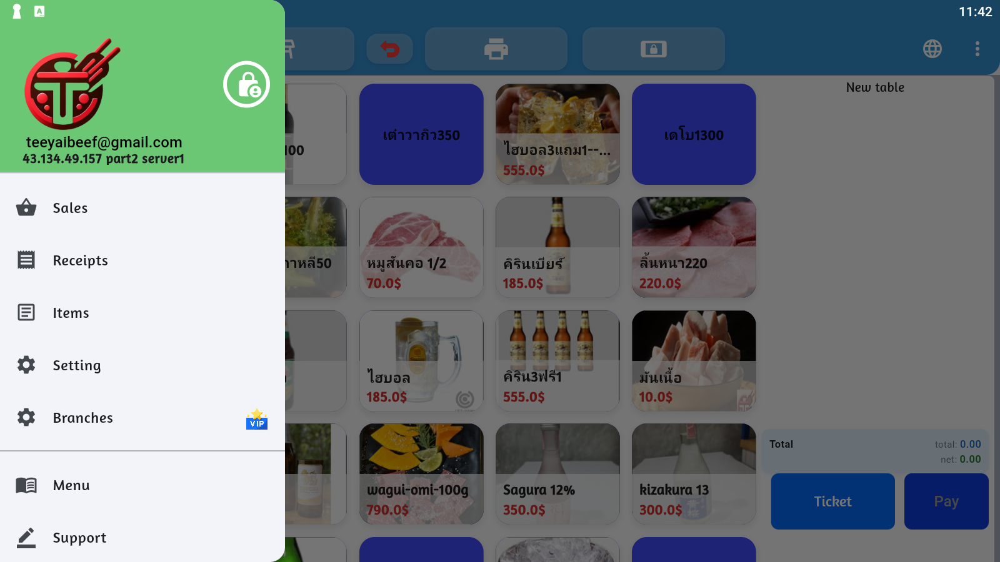

# 🏠 การเริ่มต้นและการนำทาง

## หน้าจอหลัก

หน้าจอหลักเป็นจุดเริ่มต้นการใช้งาน PosTeeYai แสดงข้อมูลสำคัญและเข้าถึงฟีเจอร์ต่าง ๆ ได้อย่างสะดวก


### 🎯 วิธีการใช้งาน

1. **เปิดแอป** PosTeeYai จากหน้าจอโทรศัพท์
2. **รอให้แอปโหลดเสร็จ** จะเห็นหน้าจอหลัก
3. **คลิกที่ ☰** (เมนูด้านซ้ายบน) เพื่อเปิดเมนูด้านข้าง

### 📱 องค์ประกอบหน้าจอหลัก

| ตำแหน่ง | องค์ประกอบ | หน้าที่ |
|---------|-----------|---------|
| ซ้ายบน | ☰ Hamburger Menu | เปิดเมนูด้านข้าง |
| กลางบน | 🏠 Title/Logo | คลิกเพื่อกลับหน้าหลัก |
| ขวาบน | ⚙️ Settings | เข้าสู่การตั้งค่าด่วน |
| ขวาบน | 🔔 Notifications | แจ้งเตือนต่าง ๆ |

## 📋 เมนูด้านข้าง (Side Menu)

เมื่อคลิกที่ Hamburger Menu (☰) จะเปิดเมนูด้านข้างแสดงฟีเจอร์หลักทั้งหมด



### เมนูหลัก

#### 📦 Items (จัดการสินค้า)
- เพิ่ม แก้ไข และลบสินค้า
- จัดการหมวดหมู่สินค้า
- ตั้งค่าราคาและสต็อก

#### 📄 Receipts (ใบเสร็จ)
- ดูประวัติการขาย
- พิมพ์ใบเสร็จ
- ค้นหาใบเสร็จย้อนหลัง

#### 📊 Reports (รายงาน)
- รายงานยอดขาย
- สถิติสินค้าขายดี
- กราฟและแผนภูมิ

#### ⚙️ Settings (การตั้งค่า)
- ข้อมูลร้าน
- การตั้งค่าเครื่องพิมพ์
- จัดการผู้ใช้งาน

#### 🏢 Branches (สาขา)
- เพิ่ม/แก้ไขสาขา
- โอนย้ายสินค้าระหว่างสาขา
- ดูสถิติแต่ละสาขา

## 🔝 ไอคอนด้านบน (Top Icons)


### การใช้งานไอคอนด้านบน

1. **Home Icon (🏠)**
   - คลิกเพื่อกลับหน้าหลัก
   - ใช้เมื่ออยู่ในเมนูย่อย ๆ

2. **Settings Icon (⚙️)**
   - เข้าการตั้งค่าด่วน
   - ปรับแต่งระบบ

3. **Notification Icon (🔔)**
   - รับแจ้งเตือนสำคัญ
   - อัพเดทระบบ


## 🗺️ พิกัดการสัมผัส (Touch Coordinates)

สำหรับการใช้งานผ่าน Automation หรือการทดสอบ

### พิกัดหลัก (1600x900)

| ตำแหน่ง | พิกัด X,Y | หน้าที่ |
|---------|-----------|---------|
| Hamburger Menu | 80, 80 | เปิดเมนูหลัก |
| Title Bar | 800, 100 | คลิกชื่อแอป |
| Settings Icon | 1520, 80 | การตั้งค่าด่วน |
| Side Menu Area | 200, 450 | พื้นที่เมนูด้านข้าง |
| Main Content | 800, 450 | พื้นที่เนื้อหาหลัก |
| Bottom Tab 1 | 200, 800 | แท็บล่างซ้าย |
| Bottom Tab 2 | 800, 800 | แท็บล่างกลาง |
| Bottom Tab 3 | 1400, 800 | แท็บล่างขวา |

## 💡 เคล็ดลับการนำทาง

### ⚡ ทางลัด
- **กลับหน้าหลัก**: กด Back button หรือคลิก Home icon
- **เปิดเมนูเร็ว**: Swipe จากขอบซ้ายของหน้าจอ
- **รีเฟรชข้อมูล**: Pull down บนหน้าจอหลัก

### 📱 ท่าทางสัมผัส (Gestures)
- **Swipe Up/Down**: เลื่อนดูรายการ
- **Long Press**: กดค้างเพื่อเปิดเมนูเพิ่มเติม
- **Pull to Refresh**: ดึงลงเพื่อรีเฟรช

## 🔄 การนำทางระหว่างหน้า

```
หน้าหลัก
  ↓ [คลิก ☰]
เมนูด้านข้าง
  ↓ [เลือกเมนู]
หน้าย่อย
  ↓ [กด Back]
หน้าหลัก
```

## 🎬 การเริ่มต้นใช้งานครั้งแรก

### ขั้นตอนการตั้งค่าเบื้องต้น

1. **เปิดแอป** PosTeeYai
2. **ตั้งค่าข้อมูลร้าน** (Settings > Store Info)
   - ชื่อร้าน
   - ที่อยู่
   - เบอร์โทรศัพท์
3. **เชื่อมต่อเครื่องพิมพ์** (Settings > Printer)
4. **เพิ่มสินค้า** (Items > Add New)
5. **เริ่มขาย!**

## 📸 ภาพประกอบเพิ่มเติม

### หน้าจอขณะทำงาน


### สถานะต่าง ๆ


## ⚠️ ข้อควรระวัง

- ตรวจสอบให้แน่ใจว่าอินเทอร์เน็ตเชื่อมต่อ (สำหรับการซิงค์ข้อมูล)
- บันทึกข้อมูลสำรอง (Backup) เป็นประจำ
- อัพเดทแอปเวอร์ชันล่าสุดเสมอ

## 🆘 การขอความช่วยเหลือ

หากพบปัญหาในการนำทาง:

1. ตรวจสอบว่าแอปเป็นเวอร์ชันล่าสุด
2. ลองปิดแอปแล้วเปิดใหม่
3. ตรวจสอบคู่มือการแก้ปัญหา
4. ติดต่อทีมสนับสนุน

---

**ถัดไป:** [จัดการสินค้า (Items)](/posteeyai/items.md)
