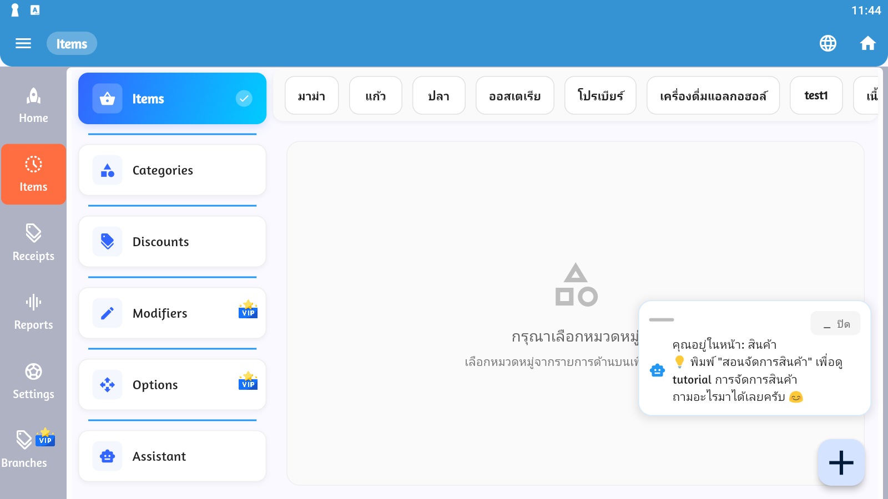

# 📦 จัดการสินค้า (Items)

การจัดการสินค้าเป็นหัวใจหลักของระบบ POS ช่วยให้คุณสามารถเพิ่ม แก้ไข และจัดการสินค้าในร้านได้อย่างมีประสิทธิภาพ



## 🛍️ ฟีเจอร์หลัก

### การจัดการสินค้าพื้นฐาน

| ฟีเจอร์ | ไอคอน | คำอธิบาย |
|---------|-------|----------|
| เพิ่มสินค้า | ➕ | เพิ่มสินค้าใหม่เข้าระบบ |
| แก้ไขสินค้า | ✏️ | แก้ไขข้อมูลสินค้าที่มีอยู่ |
| ลบสินค้า | 🗑️ | ลบสินค้าออกจากระบบ |
| ค้นหา | 🔍 | ค้นหาและกรองสินค้า |
| หมวดหมู่ | 📁 | จัดกลุ่มสินค้าตามประเภท |
| สต็อก | 📊 | จัดการจำนวนสินค้าคงคลัง |

## ➕ การเพิ่มสินค้าใหม่

### ขั้นตอนการเพิ่มสินค้า

1. **เข้าเมนู Items**
   - เปิดเมนูด้านข้าง (☰)
   - เลือก "Items"

2. **คลิกปุ่ม Add (+)**
   - หาปุ่ม ➕ ที่มุมหน้าจอ
   - คลิกเพื่อเปิดฟอร์มเพิ่มสินค้า

3. **กรอกข้อมูลสินค้า**
   ```
   - ชื่อสินค้า *
   - รหัสสินค้า (SKU)
   - ราคา *
   - หมวดหมู่
   - จำนวนสต็อก
   - รูปภาพ (ถ้ามี)
   - รายละเอียด
   ```
   > * = ข้อมูลบังคับ

4. **บันทึกข้อมูล**
   - ตรวจสอบความถูกต้อง
   - คลิกปุ่ม "Save" หรือ "บันทึก"

### ข้อมูลที่ต้องกรอก

#### ข้อมูลพื้นฐาน

**ชื่อสินค้า** (Item Name)
- ชื่อที่จะแสดงในระบบ
- ควรชัดเจนและเข้าใจง่าย
- ตัวอย่าง: "น้ำดื่ม 600ml", "ข้าวผัดกุ้ง"

**รหัสสินค้า** (SKU/Barcode)
- รหัสเฉพาะของสินค้า
- ใช้สำหรับสแกนบาร์โค้ด
- ควรไม่ซ้ำกับสินค้าอื่น

**ราคา** (Price)
- ราคาขายต่อหน่วย
- ระบุเป็นตัวเลข
- ตัวอย่าง: 15.00, 250.50

#### ข้อมูลเพิ่มเติม

**หมวดหมู่** (Category)
- จัดกลุ่มสินค้า
- ตัวอย่าง: เครื่องดื่ม, อาหาร, ของใช้

**จำนวนสต็อก** (Stock Quantity)
- จำนวนสินค้าคงเหลือ
- ระบบจะแจ้งเตือนเมื่อสต็อกต่ำ

**รูปภาพ** (Image)
- อัพโหลดรูปสินค้า
- ช่วยในการระบุสินค้า
- รองรับ JPG, PNG

## ✏️ การแก้ไขสินค้า

### วิธีแก้ไขข้อมูลสินค้า

**วิธีที่ 1: คลิกปกติ**
1. เลือกสินค้าที่ต้องการแก้ไข
2. คลิกเข้าไปที่รายการสินค้า
3. คลิกปุ่ม "Edit" หรือ ✏️
4. แก้ไขข้อมูล
5. บันทึก

**วิธีที่ 2: Long Press**
1. กดค้างที่รายการสินค้า
2. เมนูตัวเลือกจะปรากฏ
3. เลือก "Edit" หรือ "แก้ไข"
4. ทำการแก้ไข
5. บันทึก

### สิ่งที่สามารถแก้ไขได้

- ✅ ชื่อสินค้า
- ✅ ราคา
- ✅ หมวดหมู่
- ✅ จำนวนสต็อก
- ✅ รูปภาพ
- ✅ รายละเอียด
- ⚠️ รหัสสินค้า (ควรระวัง อาจมีผลกับประวัติการขาย)

## 🔍 การค้นหาและกรองสินค้า

### ค้นหาสินค้า

**ค้นหาด้วยชื่อ**
```
1. คลิกช่องค้นหา 🔍
2. พิมพ์ชื่อสินค้า
3. ผลลัพธ์จะแสดงทันที
```

**ค้นหาด้วยรหัส**
```
1. สแกนบาร์โค้ด หรือ
2. พิมพ์รหัสสินค้า
3. ระบบจะค้นหาอัตโนมัติ
```

### กรองสินค้า

**กรองตามหมวดหมู่**
- เลือกหมวดหมู่จาก Dropdown
- แสดงเฉพาะสินค้าในหมวดนั้น

**กรองตามสถานะสต็อก**
- สินค้าคงเหลือ
- สินค้าใกล้หมด
- สินค้าหมด

**เรียงลำดับ**
- A-Z (ชื่อ)
- ราคา (ต่ำ-สูง, สูง-ต่ำ)
- สต็อก (น้อย-มาก)
- ล่าสุด

## 📁 การจัดการหมวดหมู่

### สร้างหมวดหมู่ใหม่

1. เข้าเมนู Categories
2. คลิก "เพิ่มหมวดหมู่"
3. ตั้งชื่อหมวดหมู่
4. เลือกสี/ไอคอน (ถ้ามี)
5. บันทึก

### ตัวอย่างหมวดหมู่

| หมวดหมู่ | ตัวอย่างสินค้า |
|----------|---------------|
| 🍹 เครื่องดื่ม | น้ำดื่ม, น้ำหวาน, กาแฟ |
| 🍛 อาหาร | ข้าวผัด, ผัดไทย, ส้มตำ |
| 🍰 ขนม | เค้ก, คุกกี้, ขนมปัง |
| 🛒 ของใช้ | ถุงพลาสติก, กระดาษทิชชู |

## 📊 การจัดการสต็อก

### ตรวจสอบสต็อก

**ดูจำนวนคงเหลือ**
- แสดงในรายการสินค้า
- อัพเดทแบบ Real-time
- แจ้งเตือนเมื่อสต็อกต่ำ

**ปรับสต็อก**
```
1. เลือกสินค้า
2. คลิก "Adjust Stock"
3. เลือกประเภท:
   - เพิ่มสต็อก (รับของ)
   - ลดสต็อก (ตัดสต็อก, เสียหาย)
4. ระบุจำนวน
5. เหตุผล (ถ้ามี)
6. บันทึก
```

### การแจ้งเตือนสต็อก

**ตั้งค่าจุดแจ้งเตือน**
- Min Stock Level: 10
- Alert Point: 5
- Out of Stock: 0

**ประเภทการแจ้งเตือน**
- 🔴 สินค้าหมด (Out of Stock)
- 🟡 สินค้าใกล้หมด (Low Stock)
- 🟢 สินค้าพอเพียง (In Stock)

## 🏷️ การจัดการราคา

### ตั้งราคาปกติ

```
ราคาทุน: 100 บาท
กำไร: 30%
ราคาขาย: 130 บาท
```

### ราคาพิเศษ

**ส่วนลด**
- ส่วนลดตามเปอร์เซ็นต์
- ส่วนลดตามจำนวนเงิน
- ส่วนลดตามช่วงเวลา

**โปรโมชั่น**
- ซื้อ 1 แถม 1
- ซื้อครบ X ลด Y%
- แถมของสมนาคุณ

## 📷 การจัดการรูปภาพ

### อัพโหลดรูปสินค้า

1. คลิกไอคอนกล้อง 📷
2. เลือกที่มา:
   - ถ่ายภาพใหม่
   - เลือกจากแกลเลอรี่
3. ปรับแต่งรูป (ถ้าต้องการ)
4. บันทึก

### ข้อกำหนดรูปภาพ

- **ขนาดแนะนำ**: 800x800 px
- **รูปแบบ**: JPG, PNG
- **ขนาดไฟล์**: ไม่เกิน 5 MB
- **พื้นหลัง**: ควรเป็นสีเรียบ

## 🗑️ การลบสินค้า

### วิธีการลบ

1. เลือกสินค้าที่ต้องการลบ
2. Long Press หรือคลิกเมนู
3. เลือก "Delete" หรือ 🗑️
4. ยืนยันการลบ

### ⚠️ ข้อควรระวัง

- ลบแล้วไม่สามารถกู้คืนได้
- อาจมีผลกับประวัติการขาย
- ควรใช้ "Inactive" แทนการลบ

## 💡 เทคนิคการจัดการสินค้า

### Best Practices

1. **ใช้รหัสสินค้าที่เป็นระบบ**
   ```
   ตัวอย่าง:
   DRK-001 (เครื่องดื่ม-รหัส 001)
   FOD-001 (อาหาร-รหัส 001)
   SNK-001 (ขนม-รหัส 001)
   ```

2. **อัพเดทสต็อกทันที**
   - เมื่อรับของเข้า
   - เมื่อมีสินค้าเสียหาย
   - ตรวจนับสต็อกเป็นประจำ

3. **จัดหมวดหมู่อย่างเป็นระบบ**
   - แบ่งตามประเภทสินค้า
   - ใช้ชื่อที่เข้าใจง่าย
   - ไม่มีหมวดหมู่มากเกินไป

4. **ใช้รูปภาพคุณภาพดี**
   - ช่วยระบุสินค้าได้เร็ว
   - ลดข้อผิดพลาด
   - สร้างความเป็นมืออาชีพ

## 🔄 การ Import/Export สินค้า

### Import สินค้าจาก Excel

1. เตรียมไฟล์ Excel ตามรูปแบบ
2. เข้าเมนู Items
3. เลือก "Import"
4. Upload ไฟล์
5. ตรวจสอบข้อมูล
6. ยืนยันการ Import

### Export รายการสินค้า

1. เข้าเมนู Items
2. เลือก "Export"
3. เลือกรูปแบบ (Excel, CSV, PDF)
4. ดาวน์โหลดไฟล์

## 🎯 เคล็ดลับ

- ✅ ตรวจนับสต็อกจริงเป็นประจำ
- ✅ ใช้บาร์โค้ดเพื่อความรวดเร็ว
- ✅ ตั้งจุดสั่งซื้อใหม่ (Reorder Point)
- ✅ จัดกลุ่มสินค้าขายดีไว้ที่เข้าถึงง่าย
- ✅ ลบสินค้าที่ไม่ขายแล้วออก

## 🆘 การแก้ปัญหา

### ปัญหาที่พบบ่อย

**ไม่สามารถเพิ่มสินค้าได้**
- ตรวจสอบข้อมูลบังคับครบหรือไม่
- ตรวจสอบรหัสสินค้าซ้ำหรือไม่
- ลองรีสตาร์ทแอป

**รูปภาพไม่แสดง**
- ตรวจสอบขนาดไฟล์
- ตรวจสอบรูปแบบไฟล์
- ลองอัพโหลดใหม่

**สต็อกไม่ถูกต้อง**
- ตรวจนับสต็อกจริง
- ปรับสต็อกในระบบ
- ตรวจสอบประวัติการปรับ

---

**ก่อนหน้า:** [การเริ่มต้นและการนำทาง](/posteeyai/getting-started.md) | **ถัดไป:** [ใบเสร็จ (Receipts)](/posteeyai/receipts.md)
