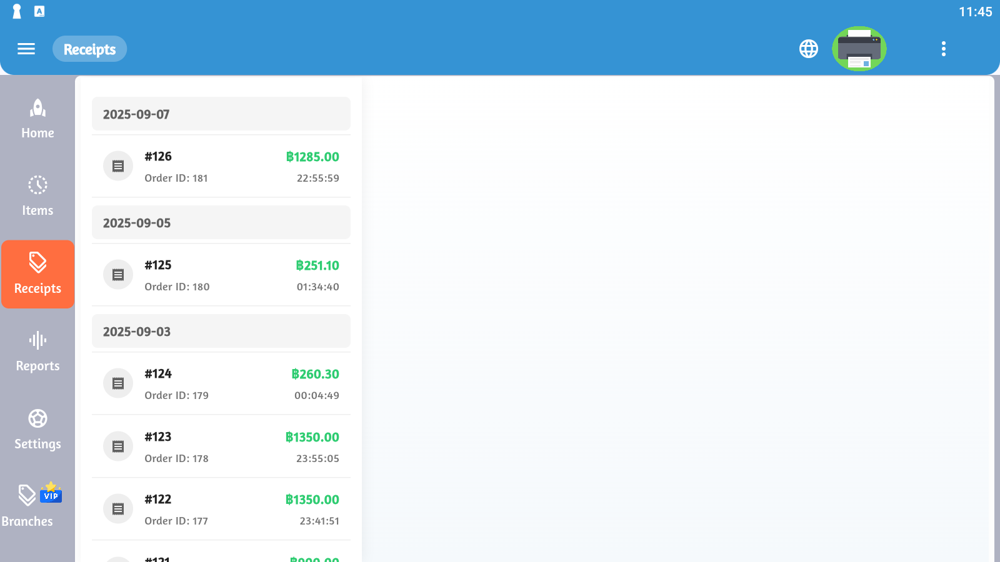

# 📄 ใบเสร็จ (Receipts)

การจัดการใบเสร็จเป็นส่วนสำคัญที่ช่วยติดตามประวัติการขายและให้บริการลูกค้า



## 📋 ภาพรวมฟีเจอร์

### ฟีเจอร์หลัก

| ฟีเจอร์ | ไอคอน | คำอธิบาย |
|---------|-------|----------|
| ดูรายละเอียด | 👁️ | ดูข้อมูลใบเสร็จทั้งหมด |
| พิมพ์ | 🖨️ | พิมพ์ใบเสร็จ |
| ค้นหา | 🔍 | ค้นหาใบเสร็จ |
| ส่งออก | 📤 | Export เป็นไฟล์ |
| ยกเลิก | ❌ | ยกเลิกใบเสร็จ |
| คืนสินค้า | ↩️ | จัดการการคืนสินค้า |

## 💰 การสร้างใบเสร็จ (New Sale)

### ขั้นตอนการขาย

**1. เริ่มต้นการขาย**
```
- เข้าหน้าจอหลัก
- คลิก "New Sale" หรือ "+""
- เริ่มเพิ่มสินค้า
```

**2. เพิ่มสินค้า**
- สแกนบาร์โค้ด หรือ
- ค้นหาชื่อสินค้า หรือ
- เลือกจากหมวดหมู่

**3. ปรับจำนวน**
- คลิกที่จำนวน
- ป้อนตัวเลขใหม่
- ยืนยัน

**4. ใช้ส่วนลด** (ถ้ามี)
- คลิกปุ่ม "Discount"
- เลือกประเภท:
  - เปอร์เซ็นต์ (%)
  - จำนวนเงิน (฿)
- ระบุค่า
- ยืนยัน

**5. ชำระเงิน**
- ตรวจสอบยอด
- เลือกวิธีชำระเงิน
- รับเงิน
- คิดเงินทอน (ถ้ามี)

**6. พิมพ์ใบเสร็จ**
- ระบบพิมพ์อัตโนมัติ หรือ
- คลิก "Print" เพื่อพิมพ์เพิ่ม

### รายละเอียดในใบเสร็จ

```
=====================================
         ชื่อร้าน
      ที่อยู่ร้าน
    เบอร์โทรศัพท์
=====================================
Receipt No: REC-20250811-001
Date: 11/08/2025 14:30:25
Cashier: สมชาย ใจดี
=====================================
รายการสินค้า

1. น้ำดื่ม 600ml
   15.00 x 2 = 30.00

2. ข้าวผัดกุ้ง
   45.00 x 1 = 45.00

3. ชาเย็น
   20.00 x 1 = 20.00
-------------------------------------
Subtotal:        95.00
Discount (10%):  -9.50
-------------------------------------
Total:           85.50
Cash:           100.00
Change:          14.50
=====================================
  ขอบคุณที่ใช้บริการ
      กรุณาเก็บใบเสร็จไว้
=====================================
```

## 👁️ การดูรายละเอียดใบเสร็จ

### ข้อมูลที่แสดง

**ข้อมูลหัวใบเสร็จ**
- เลขที่ใบเสร็จ
- วันที่และเวลา
- ชื่อพนักงานขาย
- สาขา (ถ้ามี)

**รายการสินค้า**
- ชื่อสินค้า
- ราคาต่อหน่วย
- จำนวน
- ราคารวม
- ส่วนลด (ถ้ามี)

**สรุปยอด**
- ยอดรวมก่อนภาษี
- ภาษี (VAT)
- ส่วนลดรวม
- ยอดรวมทั้งหมด

**ข้อมูลการชำระเงิน**
- วิธีการชำระเงิน
- จำนวนเงินรับ
- เงินทอน

## 🔍 การค้นหาใบเสร็จ

### ค้นหาด้วยเลขที่ใบเสร็จ

```
1. คลิกช่องค้นหา
2. พิมพ์เลขที่ใบเสร็จ
   ตัวอย่าง: REC-20250811-001
3. กด Enter
```

### ค้นหาด้วยวันที่

```
1. เลือก "Search by Date"
2. กำหนดช่วงวันที่:
   - วันที่เริ่มต้น
   - วันที่สิ้นสุด
3. คลิก "Search"
```

### ค้นหาด้วยเงื่อนไขอื่น

**ตามพนักงาน**
- เลือกชื่อพนักงาน
- ดูใบเสร็จของพนักงานคนนั้น

**ตามช่วงราคา**
- ระบุราคาต่ำสุด-สูงสุด
- ค้นหา

**ตามสินค้า**
- พิมพ์ชื่อสินค้า
- ดูใบเสร็จที่มีสินค้านั้น

## 🖨️ การพิมพ์ใบเสร็จ

### การตั้งค่าเครื่องพิมพ์

**เชื่อมต่อเครื่องพิมพ์**
1. Settings > Printer
2. เลือกประเภทเครื่องพิมพ์:
   - Bluetooth Printer
   - WiFi Printer
   - USB Printer
3. เลือกเครื่องพิมพ์
4. ทดสอบการพิมพ์

**ตั้งค่ารูปแบบใบเสร็จ**
- ขนาดกระดาษ (58mm, 80mm)
- แสดงโลโก้
- จำนวนบรรทัดว่าง
- ข้อความท้ายใบเสร็จ

### วิธีพิมพ์

**พิมพ์ทันทีหลังขาย**
- เปิดใช้ Auto-print
- พิมพ์อัตโนมัติ

**พิมพ์ภายหลัง**
1. เข้ารายการใบเสร็จ
2. เลือกใบเสร็จที่ต้องการ
3. คลิก "Print" 🖨️
4. เลือกจำนวนที่ต้องการพิมพ์
5. ยืนยัน

**พิมพ์แบบย่อ (สลิป)**
- สำหรับลูกค้า
- ข้อมูลสำคัญเท่านั้น

**พิมพ์แบบเต็ม (A4)**
- สำหรับบัญชี
- ข้อมูลครบถ้วน

## 📤 การส่งออกใบเสร็จ

### รูปแบบการส่งออก

**PDF**
- เหมาะสำหรับพิมพ์
- เก็บรูปแบบได้ดี

**Excel**
- เหมาะสำหรับวิเคราะห์
- แก้ไขได้

**CSV**
- นำเข้าระบบอื่นได้
- ขนาดเล็ก

### วิธีส่งออก

1. เลือกช่วงวันที่
2. เลือกรูปแบบไฟล์
3. คลิก "Export"
4. เลือกที่บันทึก:
   - Local Storage
   - Cloud (Google Drive, Dropbox)
   - Email
5. ยืนยัน

## ❌ การยกเลิกใบเสร็จ

### เงื่อนไขการยกเลิก

✅ **สามารถยกเลิกได้**
- ใบเสร็จใหม่ (ภายในวันเดียวกัน)
- ยังไม่ได้ปิดยอด
- มีสิทธิ์ยกเลิก

❌ **ไม่สามารถยกเลิกได้**
- ปิดยอดแล้ว
- เกินกำหนดเวลา
- ไม่มีสิทธิ์

### วิธีการยกเลิก

```
1. เลือกใบเสร็จที่ต้องการยกเลิก
2. คลิก "Cancel" หรือ ❌
3. ระบุเหตุผล:
   - ผิดพลาด
   - ลูกค้ายกเลิก
   - อื่น ๆ (ระบุ)
4. ยืนยันการยกเลิก
5. ป้อน PIN (ถ้ากำหนด)
```

### ผลของการยกเลิก

- ❌ ใบเสร็จถูกทำเครื่องหมายยกเลิก
- 🔄 สต็อกสินค้ากลับคืน
- 📊 รายงานอัพเดท
- 📝 บันทึกเหตุผล

## ↩️ การคืนสินค้าและคืนเงิน

### ประเภทการคืน

**คืนสินค้าทั้งหมด**
- คืนทุกรายการ
- คืนเงินเต็มจำนวน

**คืนสินค้าบางส่วน**
- เลือกรายการที่ต้องการคืน
- คืนเงินตามสัดส่วน

### ขั้นตอนการคืนสินค้า

```
1. ค้นหาใบเสร็จเดิม
2. ตรวจสอบเงื่อนไขการคืน:
   - ภายในกำหนด (7 วัน)
   - สินค้าไม่เสียหาย
   - มีใบเสร็จ
3. คลิก "Return" ↩️
4. เลือกสินค้าที่คืน
5. ระบุเหตุผล
6. คืนเงิน:
   - เงินสด
   - บัตรเครดิต (คืนบัตร)
   - เครดิตร้าน
7. พิมพ์ใบคืนเงิน
```

### ใบรับคืนเงิน

```
=====================================
     ใบรับคืนสินค้า/เงิน
=====================================
Return No: RET-20250811-001
Original Receipt: REC-20250811-001
Date: 11/08/2025 16:45:00
=====================================
สินค้าที่คืน:

1. น้ำดื่ม 600ml
   15.00 x 2 = 30.00

เหตุผล: สินค้าเสียหาย
-------------------------------------
Total Refund: 30.00
Method: เงินสด
=====================================
  ลายเซ็นลูกค้า: _____________
  ลายเซ็นพนักงาน: _____________
=====================================
```

## 📊 รายงานใบเสร็จ

### รายงานที่มี

**รายงานรายวัน**
- ใบเสร็จทั้งหมด
- ยอดรวม
- พนักงานแต่ละคน

**รายงานรายเดือน**
- สรุปรายเดือน
- เปรียบเทียบเดือนก่อน
- กราฟแนวโน้ม

**รายงานตามช่วงเวลา**
- กำหนดเอง
- ช่วงที่ต้องการ

## 💳 วิธีการชำระเงิน

### ประเภทการชำระเงิน

| วิธีการ | ไอคอน | รายละเอียด |
|---------|-------|-----------|
| เงินสด | 💵 | ชำระด้วยเงินสด |
| บัตรเครดิต | 💳 | Visa, Mastercard |
| โมบายแบงก์กิ้ง | 📱 | PromptPay, QR Code |
| บัตรเดบิต | 💳 | ATM Card |
| เครดิตร้าน | 🎫 | คะแนนสะสม, วงเงิน |

### การรับชำระแบบผสม

```
ตัวอย่าง:
ยอดรวม: 500 บาท
- เงินสด: 200 บาท
- บัตรเครดิต: 300 บาท
Total: 500 บาท ✓
```

## 🔐 ความปลอดภัย

### การควบคุมการเข้าถึง

**สิทธิ์ต่าง ๆ**
- ดูใบเสร็จ (ทุกคน)
- พิมพ์ซ้ำ (พนักงาน+)
- ยกเลิก (หัวหน้า+)
- คืนเงิน (ผู้จัดการ+)

**การป้องกัน**
- ป้อน PIN สำหรับการยกเลิก
- บันทึก Log ทุกการแก้ไข
- แจ้งเตือนผู้จัดการ

## 💡 เทคนิคการใช้งาน

### เพิ่มความเร็วในการขาย

1. **ใช้บาร์โค้ด**
   - สแกนเร็ว
   - ลดข้อผิดพลาด

2. **จัดหมวดหมู่สินค้า**
   - สินค้าขายดีไว้หน้า
   - จัดกลุ่มตามประเภท

3. **ใช้ Favorite**
   - เพิ่มสินค้าขายดีใน Favorite
   - เข้าถึงได้เร็ว

4. **ตั้งค่า Quick Discount**
   - 5%, 10%, 20%
   - คลิกครั้งเดียว

### การดูแลใบเสร็จ

- 📁 เก็บสำเนาไว้อย่างน้อย 5 ปี
- 💾 Backup ข้อมูลเป็นประจำ
- 🔍 ตรวจสอบใบเสร็จเป็นประจำ
- 🗂️ จัดเก็บเป็นหมวดหมู่

## 🆘 การแก้ปัญหา

### ปัญหาที่พบบ่อย

**เครื่องพิมพ์ไม่ทำงาน**
```
1. ตรวจสอบการเชื่อมต่อ (Bluetooth/WiFi)
2. ตรวจสอบกระดาษ
3. รีสตาร์ทเครื่องพิมพ์
4. ตั้งค่าเครื่องพิมพ์ใหม่
```

**ใบเสร็จหาไม่เจอ**
```
1. ตรวจสอบช่วงวันที่
2. ค้นหาด้วยเลขที่
3. ตรวจสอบฟิลเตอร์
4. ติดต่อ Admin
```

**ไม่สามารถยกเลิกใบเสร็จได้**
```
1. ตรวจสอบสิทธิ์
2. ตรวจสอบสถานะใบเสร็จ
3. ติดต่อหัวหน้า/ผู้จัดการ
```

## 📋 Checklist ประจำวัน

### ก่อนเปิดร้าน
- [ ] เปิดเครื่องพิมพ์
- [ ] ทดสอบพิมพ์ใบเสร็จ
- [ ] ตรวจสอบกระดาษ
- [ ] เตรียมเงินทอน

### หลังปิดร้าน
- [ ] ตรวจนับใบเสร็จ
- [ ] ตรวจสอบยอดเงินสด
- [ ] พิมพ์รายงานรายวัน
- [ ] ปิดยอด
- [ ] Backup ข้อมูล

---

**ก่อนหน้า:** [จัดการสินค้า (Items)](/posteeyai/items.md) | **ถัดไป:** [รายงาน (Reports)](/posteeyai/reports.md)
