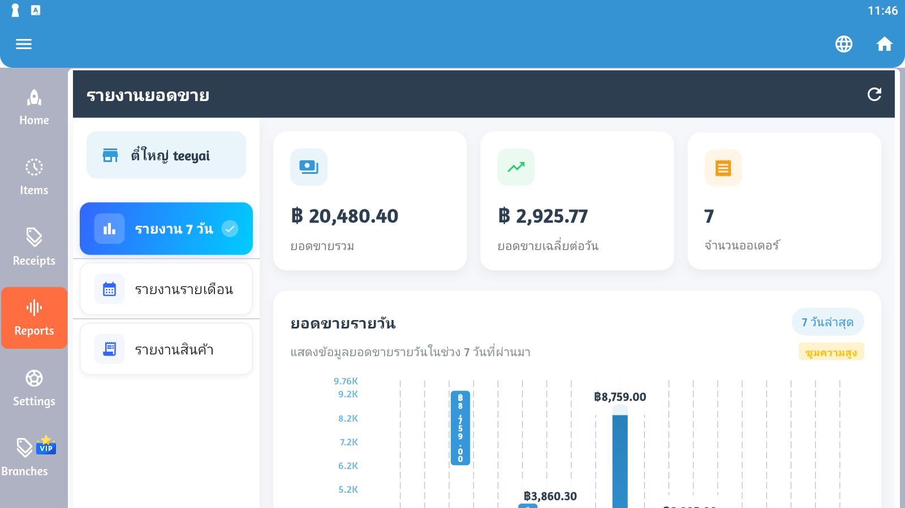

# 📊 รายงาน (Reports)

รายงานช่วยให้คุณวิเคราะห์ยอดขายและติดตามประสิทธิภาพธุรกิจได้อย่างครบถ้วน



## 📈 ประเภทรายงาน

### รายงานหลัก

| ประเภท | ไอคอน | คำอธิบาย |
|--------|-------|----------|
| ยอดขาย | 💰 | รายงานยอดขายรวม |
| สินค้า | 📦 | รายงานสินค้าขายดี |
| พนักงาน | 👤 | ประสิทธิภาพพนักงาน |
| สต็อก | 📊 | รายงานสินค้าคงคลัง |
| กำไร | 💵 | รายงานกำไร-ขาดทุน |
| ลูกค้า | 👥 | พฤติกรรมลูกค้า |

## 💰 รายงานยอดขาย

### รายงานรายวัน (Daily Sales)

**ข้อมูลที่แสดง**
- ยอดขายรวมวันนี้
- จำนวนใบเสร็จทั้งหมด
- ยอดขายเฉลี่ยต่อใบเสร็จ
- เปรียบเทียบกับเมื่อวาน

**ตัวอย่างรายงาน**
```
╔═══════════════════════════════════╗
║   รายงานยอดขายประจำวัน          ║
║   วันที่: 11 สิงหาคม 2025        ║
╠═══════════════════════════════════╣
║ ยอดขายรวม:       12,350.00 บาท  ║
║ จำนวนใบเสร็จ:             45 ใบ  ║
║ ยอดเฉลี่ย/ใบ:       274.44 บาท  ║
║ สินค้าที่ขาย:              128 ชิ้น ║
╠═══════════════════════════════════╣
║ เงินสด:           8,500.00 บาท  ║
║ บัตรเครดิต:      3,200.00 บาท  ║
║ QR Code:            650.00 บาท  ║
╠═══════════════════════════════════╣
║ เปรียบเทียบเมื่อวาน:      +15%  ║
╚═══════════════════════════════════╝
```

### รายงานรายเดือน (Monthly Sales)

**ข้อมูลที่แสดง**
- ยอดขายรวมทั้งเดือน
- แนวโน้มการขาย
- วันที่ขายดีที่สุด
- เปรียบเทียบเดือนก่อน

**กราฟแสดงผล**
- กราฟเส้น (Line Chart) - แนวโน้ม
- กราฟแท่ง (Bar Chart) - เปรียบเทียบ
- กราฟวงกลม (Pie Chart) - สัดส่วน

### รายงานรายปี (Yearly Sales)

- ยอดขายรวมทั้งปี
- เดือนที่ขายดีที่สุด
- เทรนด์รายปี
- เป้าหมายปีหน้า

### รายงานตามช่วงเวลา (Custom Period)

```
1. เลือก "Custom Report"
2. กำหนดช่วงเวลา:
   - วันที่เริ่มต้น
   - วันที่สิ้นสุด
3. เลือกประเภทรายงาน
4. คลิก "Generate"
```

## 📦 รายงานสินค้า

### สินค้าขายดี (Top Selling Items)

**Top 10 สินค้า**
```
อันดับ | สินค้า              | จำนวนขาย | ยอดขาย
-------|-------------------|----------|----------
  1    | น้ำดื่ม 600ml      | 250 ขวด  | 3,750 บาท
  2    | ข้าวผัดกุ้ง        | 85 จาน   | 3,825 บาท
  3    | ชาเย็น             | 120 แก้ว | 2,400 บาท
  4    | กาแฟเย็น           | 95 แก้ว  | 2,375 บาท
  5    | ผัดไทย             | 60 จาน   | 2,400 บาท
```

### สินค้าขายช้า (Slow Moving)

- รายการสินค้าที่ขายช้า
- สินค้าที่ไม่มีการขายเลย
- คำแนะนำการจัดการ

### มูลค่าสินค้าคงคลัง (Stock Value)

```
╔═══════════════════════════════════╗
║     มูลค้าสินค้าคงคลัง          ║
╠═══════════════════════════════════╣
║ มูลค่าราคาทุน:   45,500.00 บาท  ║
║ มูลค่าราคาขาย:   59,150.00 บาท  ║
║ กำไรคาดการณ์:    13,650.00 บาท  ║
║ จำนวนรายการ:              156 รายการ ║
╚═══════════════════════════════════╝
```

## 👤 รายงานพนักงาน

### ประสิทธิภาพพนักงาน

**รายงานรายบุคคล**
```
พนักงาน: สมชาย ใจดี
วันที่: 11 สิงหาคม 2025

- ใบเสร็จทั้งหมด: 15 ใบ
- ยอดขายรวม: 4,250 บาท
- ยอดเฉลี่ย/ใบ: 283.33 บาท
- เวลาทำงาน: 8 ชั่วโมง
- ยอดขาย/ชม.: 531.25 บาท
```

**เปรียบเทียบพนักงาน**
```
อันดับ | พนักงาน        | ใบเสร็จ | ยอดขาย
-------|---------------|---------|----------
  1    | สมหญิง รักงาน  | 20 ใบ   | 5,800 บาท
  2    | สมชาย ใจดี     | 15 ใบ   | 4,250 บาท
  3    | สมศรี ขยัน     | 12 ใบ   | 3,400 บาท
```

## 💵 รายงานกำไร-ขาดทุน

### กำไรขั้นต้น (Gross Profit)

```
╔═══════════════════════════════════╗
║   รายงานกำไรขาดทุน - เดือนสิงหาคม ║
╠═══════════════════════════════════╣
║ รายได้จากการขาย: 250,000.00 บาท ║
║ ต้นทุนขาย:        175,000.00 บาท ║
║ ───────────────────────────────── ║
║ กำไรขั้นต้น:       75,000.00 บาท ║
║ อัตรากำไร:                    30% ║
╠═══════════════════════════════════╣
║ ค่าใช้จ่าย:                       ║
║ - เงินเดือน:       30,000.00 บาท ║
║ - ค่าเช่า:         15,000.00 บาท ║
║ - ค่าไฟ/น้ำ:        3,500.00 บาท ║
║ - อื่น ๆ:           5,000.00 บาท ║
║ ───────────────────────────────── ║
║ รวมค่าใช้จ่าย:     53,500.00 บาท ║
╠═══════════════════════════════════╣
║ กำไรสุทธิ:         21,500.00 บาท ║
║ อัตรากำไรสุทธิ:              8.6% ║
╚═══════════════════════════════════╝
```

### รายงานกำไรตามหมวดหมู่

```
หมวดหมู่      | ยอดขาย  | ต้นทุน  | กำไร   | %
--------------|---------|---------|--------|-----
เครื่องดื่ม    | 80,000  | 48,000  | 32,000 | 40%
อาหาร         | 120,000 | 90,000  | 30,000 | 25%
ขนม           | 30,000  | 21,000  | 9,000  | 30%
ของใช้        | 20,000  | 16,000  | 4,000  | 20%
```

## 👥 รายงานลูกค้า

### สถิติลูกค้า

**ลูกค้าประจำ (Regular Customers)**
- จำนวนลูกค้าทั้งหมด
- ลูกค้าใหม่ในเดือนนี้
- ลูกค้าที่กลับมาซื้อซ้ำ
- อัตราการกลับมา (Return Rate)

**ยอดซื้อเฉลี่ยต่อลูกค้า**
```
╔═══════════════════════════════════╗
║   สถิติลูกค้า - เดือนสิงหาคม      ║
╠═══════════════════════════════════╣
║ ลูกค้าทั้งหมด:            245 คน  ║
║ ลูกค้าใหม่:                35 คน  ║
║ ลูกค้าประจำ:              210 คน  ║
║ อัตราลูกค้ากลับมา:          85.7% ║
╠═══════════════════════════════════╣
║ ยอดซื้อเฉลี่ย:      1,020.41 บาท ║
║ จำนวนซื้อเฉลี่ย:       3.7 ครั้ง  ║
╚═══════════════════════════════════╝
```

## 📊 การแสดงผลข้อมูล

### ประเภทกราฟ

**กราฟเส้น (Line Chart)**
- แนวโน้มยอดขาย
- การเติบโต
- เปรียบเทียบช่วงเวลา

**กราฟแท่ง (Bar Chart)**
- เปรียบเทียบรายการ
- สินค้าขายดี
- ยอดขายพนักงาน

**กราฟวงกลม (Pie Chart)**
- สัดส่วนการขาย
- ช่องทางการชำระเงิน
- หมวดหมู่สินค้า

**ตาราง (Table)**
- ข้อมูลละเอียด
- สามารถ Export ได้

## 📤 การส่งออกรายงาน

### รูปแบบไฟล์

**PDF**
```
- เหมาะสำหรับพิมพ์
- เก็บรูปแบบได้ดี
- แชร์ง่าย
```

**Excel (.xlsx)**
```
- วิเคราะห์ข้อมูลต่อได้
- สร้างกราฟเอง
- คำนวณเพิ่มเติม
```

**CSV**
```
- นำเข้าระบบอื่น
- ขนาดไฟล์เล็ก
- รองรับหลายโปรแกรม
```

### วิธีส่งออก

```
1. เปิดรายงานที่ต้องการ
2. คลิกปุ่ม "Export" 📤
3. เลือกรูปแบบไฟล์
4. เลือกตำแหน่งบันทึก:
   - Local Storage
   - Google Drive
   - Email
   - Print
5. ยืนยัน
```

## ⚙️ การตั้งค่ารายงาน

### กำหนดช่วงเวลาเริ่มต้น

- วันนี้ (Today)
- เมื่อวาน (Yesterday)
- 7 วันที่แล้ว (Last 7 Days)
- เดือนนี้ (This Month)
- เดือนที่แล้ว (Last Month)
- กำหนดเอง (Custom)

### ฟิลเตอร์ข้อมูล

**ตามสาขา**
- รายงานแต่ละสาขา
- รายงานรวมทุกสาขา
- เปรียบเทียบสาขา

**ตามหมวดหมู่**
- เลือกหมวดหมู่สินค้า
- ดูรายงานเฉพาะหมวด

**ตามพนักงาน**
- รายงานแต่ละคน
- รายงานรวมทีม

### การแสดงผล

**หน่วยเงิน**
- แสดงจุดทศนิยม
- เว้นบรรทัดพัน
- สัญลักษณ์สกุลเงิน

**ภาษา**
- ไทย
- English

**รูปแบบวันที่**
- DD/MM/YYYY
- MM/DD/YYYY
- YYYY-MM-DD

## 📅 การกำหนดรายงานอัตโนมัติ

### ตั้งเวลาส่งรายงาน (Scheduled Reports)

```
1. Settings > Reports > Schedule
2. เลือกประเภทรายงาน
3. กำหนดความถี่:
   - รายวัน (Daily)
   - รายสัปดาห์ (Weekly)
   - รายเดือน (Monthly)
4. เลือกเวลาส่ง
5. ระบุอีเมลผู้รับ
6. บันทึก
```

**ตัวอย่าง**
```
รายงาน: รายงานยอดขายประจำวัน
ความถี่: ทุกวัน เวลา 23:00 น.
ส่งถึง: manager@example.com
รูปแบบ: PDF
สถานะ: เปิดใช้งาน ✓
```

## 💡 เทคนิคการใช้รายงาน

### การวิเคราะห์ยอดขาย

1. **ดูแนวโน้ม**
   - ติดตามยอดขายรายวัน
   - เปรียบเทียบกับสัปดาห์ก่อน
   - หาจุดเพิ่มยอด

2. **วิเคราะห์สินค้า**
   - สินค้าขายดี → เพิ่มสต็อก
   - สินค้าขายช้า → ทำโปรโมชั่น
   - สินค้าไม่ขาย → พิจารณาเลิกขาย

3. **ประสิทธิภาพทีม**
   - เปรียบเทียบพนักงาน
   - หา Best Practices
   - ฝึกอบรมทีม

### การตั้งเป้าหมาย

**เป้าหมายรายวัน**
```
เป้าหมาย: 15,000 บาท/วัน
ยอดขายจริง: 12,350 บาท
ความสำเร็จ: 82.3%
ต้องการเพิ่ม: 2,650 บาท
```

**เป้าหมายรายเดือน**
```
เป้าหมาย: 450,000 บาท
วันที่ผ่านไป: 11 วัน
ยอดสะสม: 135,850 บาท
คาดการณ์สิ้นเดือน: 371,046 บาท
สถานะ: ⚠️ ต่ำกว่าเป้า 17.5%
```

## 🎯 Dashboard หลัก

### ข้อมูลสำคัญแสดงที่ Dashboard

```
╔═══════════════════════════════════════════════════════╗
║              📊 Dashboard PosTeeYai                   ║
╠═══════════════════════════════════════════════════════╣
║  วันนี้            │ เดือนนี้         │ ปีนี้        ║
║  12,350 บาท        │ 135,850 บาท     │ 1,247,500 บาท ║
║  ────────────────────────────────────────────────────║
║  💰 ยอดขายรวม:                      12,350.00 บาท   ║
║  📄 จำนวนใบเสร็จ:                            45 ใบ   ║
║  📦 สินค้าขายดี:                         น้ำดื่ม 600ml║
║  👤 พนักงานขายเก่ง:                    สมหญิง รักงาน  ║
║  ────────────────────────────────────────────────────║
║  📊 กราฟยอดขาย 7 วันย้อนหลัง:                        ║
║     ▁▃▅▄▆▇█                                          ║
╚═══════════════════════════════════════════════════════╝
```

## 🔔 การแจ้งเตือน (Alerts)

### ตั้งค่าการแจ้งเตือน

**ยอดขายต่ำกว่าเป้า**
```
- ยอดขายต่ำกว่า X% ของเป้า
- แจ้งเตือนที่ X ช.ม.
- ส่งถึง: Manager, Owner
```

**สต็อกใกล้หมด**
```
- สินค้าเหลือต่ำกว่า X ชิ้น
- แจ้งทันที
- ส่งถึง: ฝ่ายจัดซื้อ
```

**ยอดขายผิดปกติ**
```
- สูงหรือต่ำผิดปกติ
- เปรียบเทียบค่าเฉลี่ย
- ตรวจสอบข้อผิดพลาด
```

## 🆘 การแก้ปัญหา

### รายงานแสดงข้อมูลไม่ถูกต้อง

```
1. ตรวจสอบช่วงเวลา
2. ตรวจสอบฟิลเตอร์
3. รีเฟรชรายงาน
4. ตรวจสอบการซิงค์ข้อมูล
```

### ไม่สามารถ Export ได้

```
1. ตรวจสอบพื้นที่จัดเก็บ
2. ตรวจสอบสิทธิ์การเข้าถึง
3. ลองรูปแบบไฟล์อื่น
4. ลดขนาดข้อมูล (กรองช่วงเวลา)
```

### กราฟไม่แสดง

```
1. ตรวจสอบข้อมูล
2. ลองเปลี่ยนประเภทกราฟ
3. รีสตาร์ทแอป
4. อัพเดทแอป
```

## 📋 Checklist การดูรายงาน

### รายวัน
- [ ] รายงานยอดขายวันนี้
- [ ] เปรียบเทียบกับเมื่อวาน
- [ ] ตรวจสอบสินค้าขายดี
- [ ] ตรวจสอบเงินสดในลิ้นชัก

### รายสัปดาห์
- [ ] แนวโน้มยอดขาย
- [ ] สินค้าขายช้า
- [ ] ประสิทธิภาพพนักงาน
- [ ] สต็อกคงเหลือ

### รายเดือน
- [ ] รายงานกำไรขาดทุน
- [ ] เปรียบเทียบเดือนก่อน
- [ ] วิเคราะห์ต้นทุน
- [ ] วางแผนเดือนหน้า

---

**ก่อนหน้า:** [ใบเสร็จ (Receipts)](/posteeyai/receipts.md) | **ถัดไป:** [การตั้งค่า (Settings)](/posteeyai/settings.md)
