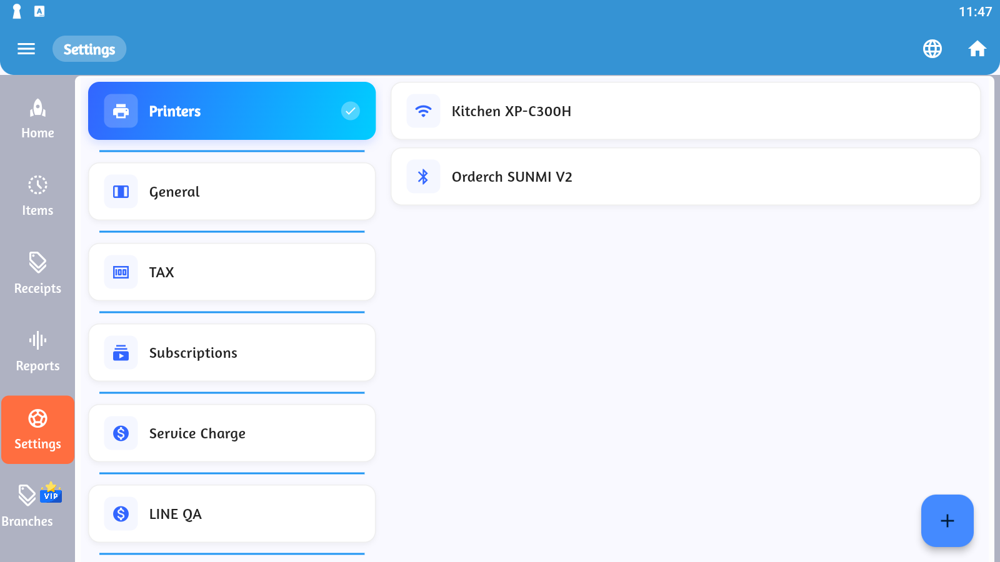

# ⚙️ การตั้งค่า (Settings)

การตั้งค่าระบบให้เหมาะสมกับร้านของคุณ เพื่อการใช้งานที่มีประสิทธิภาพ



## 🏪 ข้อมูลร้าน (Store Information)

### การตั้งค่าข้อมูลร้าน

**ข้อมูลพื้นฐาน**
```
ชื่อร้าน: ร้านกาแฟ ABC
ที่อยู่: 123 ถนนสุขุมวิท แขวงคลองเตย
         เขตคลองเตย กรุงเทพฯ 10110
โทรศัพท์: 02-123-4567
อีเมล: info@abccafe.com
เว็บไซต์: www.abccafe.com
```

**เลขประจำตัวผู้เสียภาษี**
```
Tax ID: 0-1234-56789-01-2
Branch: สำนักงานใหญ่ (Head Office)
```

**โลโก้ร้าน**
- อัพโหลดโลโก้
- ขนาดแนะนำ: 300x300 px
- รูปแบบ: PNG (พื้นหลังโปร่งใส)
- แสดงบนใบเสร็จ

### การแสดงผลบนใบเสร็จ

```
╔═══════════════════════════════════╗
║        [โลโก้ร้าน]                ║
║      ร้านกาแฟ ABC                 ║
║  123 ถนนสุขุมวิท แขวงคลองเตย       ║
║    เขตคลองเตย กรุงเทพฯ 10110       ║
║      โทร: 02-123-4567             ║
║   Tax ID: 0-1234-56789-01-2       ║
╚═══════════════════════════════════╝
```

## 🖨️ การตั้งค่าเครื่องพิมพ์ (Printer Settings)

### ประเภทเครื่องพิมพ์

| ประเภท | การเชื่อมต่อ | ความเหมาะสม |
|--------|-------------|-------------|
| Bluetooth Printer | Bluetooth | มือถือ, ไม่ต้องใช้สาย |
| WiFi Printer | WiFi | หลายอุปกรณ์ใช้ร่วม |
| USB Printer | USB Cable | เสถียรที่สุด |
| Network Printer | LAN/Ethernet | สำนักงาน, ขนาดใหญ่ |

### การเชื่อมต่อเครื่องพิมพ์

**Bluetooth Printer**
```
1. เปิด Bluetooth ทั้งโทรศัพท์และเครื่องพิมพ์
2. Settings > Printer > Add Printer
3. เลือก "Bluetooth"
4. ค้นหาอุปกรณ์
5. เลือกเครื่องพิมพ์
6. จับคู่อุปกรณ์ (Pair)
7. ทดสอบพิมพ์
```

**WiFi Printer**
```
1. เชื่อมต่อเครื่องพิมพ์กับ WiFi
2. Settings > Printer > Add Printer
3. เลือก "WiFi"
4. ค้นหาเครื่องพิมพ์ในเครือข่าย
5. เลือกเครื่องพิมพ์
6. ใส่รหัสผ่าน (ถ้ามี)
7. ทดสอบพิมพ์
```

### ตั้งค่าการพิมพ์

**ขนาดกระดาษ**
- 58mm (สลิปเล็ก)
- 80mm (ใบเสร็จมาตรฐาน)
- A4 (รายงาน)

**การพิมพ์อัตโนมัติ**
```
☑ พิมพ์อัตโนมัติหลังขาย
☑ พิมพ์ 2 ชุด (ลูกค้า + ร้าน)
☐ พิมพ์ในครัว (สำหรับร้านอาหาร)
☑ เปิด Cash Drawer อัตโนมัติ
```

**รูปแบบใบเสร็จ**
```
☑ แสดงโลโก้
☑ แสดง Tax ID
☑ แสดงบาร์โค้ดเลขที่ใบเสร็จ
☑ แสดงข้อความท้ายใบเสร็จ
☐ พิมพ์สองภาษา (ไทย-อังกฤษ)
```

**ข้อความท้ายใบเสร็จ**
```
ขอบคุณที่ใช้บริการ
Thank you for your purchase

เก็บใบเสร็จไว้สำหรับการคืนสินค้า
Keep receipt for returns

www.abccafe.com
FB: @abccafe | IG: @abccafe
```

### การแก้ปัญหาเครื่องพิมพ์

**เครื่องพิมพ์เชื่อมต่อไม่ได้**
```
1. ตรวจสอบพลังงาน
2. ตรวจสอบ Bluetooth/WiFi
3. ลบอุปกรณ์แล้วจับคู่ใหม่
4. รีสตาร์ทเครื่องพิมพ์
5. ลองเชื่อมต่อใหม่
```

**พิมพ์ไม่ออก**
```
1. ตรวจสอบกระดาษ
2. ตรวจสอบหมึก/ริบบิ้น
3. ทดสอบพิมพ์จากเครื่องพิมพ์
4. ตรวจสอบ Driver
```

**พิมพ์ผิดรูปแบบ**
```
1. ตั้งค่าขนาดกระดาษ
2. เลือก Template ที่ถูกต้อง
3. อัพเดท Firmware
```

## 👥 การจัดการผู้ใช้ (User Management)

### ระดับผู้ใช้งาน

| ระดับ | สิทธิ์ | เหมาะสำหรับ |
|-------|--------|------------|
| 🔴 Owner | ทุกอย่าง | เจ้าของ |
| 🟠 Manager | จัดการทั้งหมด (ยกเว้นลบข้อมูล) | ผู้จัดการ |
| 🟡 Supervisor | จัดการการขาย, ดูรายงาน | หัวหน้างาน |
| 🟢 Cashier | ขาย, ดูสินค้า | พนักงานขาย |
| 🔵 Viewer | ดูรายงานเท่านั้น | ผู้สอบบัญชี |

### การเพิ่มผู้ใช้ใหม่

```
1. Settings > Users > Add User
2. กรอกข้อมูล:
   - ชื่อ-นามสกุล
   - Username
   - Password
   - ระดับผู้ใช้
   - เบอร์โทร
   - อีเมล
3. กำหนดสิทธิ์
4. บันทึก
```

### การตั้งค่า PIN

```
☑ ใช้ PIN 4 หลัก
☑ ต้องป้อน PIN เมื่อ:
  - เปิดโปรแกรม
  - ยกเลิกใบเสร็จ
  - คืนเงิน
  - ปรับส่วนลด
  - ดูรายงาน
```

## 💳 วิธีการชำระเงิน (Payment Methods)

### เปิด/ปิดช่องทางชำระเงิน

```
☑ เงินสด (Cash)
☑ บัตรเครดิต/เดบิต (Credit/Debit Card)
☑ QR Code (PromptPay)
☑ Mobile Banking
☐ เครดิตร้าน (Store Credit)
☐ บัตรกำนัล (Voucher)
```

### ตั้งค่า QR Code PromptPay

```
เบอร์โทรศัพท์: 089-123-4567
หรือ
เลขบัตรประชาชน: 1-2345-67890-12-3
หรือ
Tax ID: 0-1234-56789-01-2

QR Code จะถูกสร้างอัตโนมัติ
```

### ตั้งค่าเครื่องรูดบัตร

```
ประเภทเครื่อง:
- EMV Chip Reader
- Contactless (NFC)
- Magnetic Stripe

เชื่อมต่อผ่าน:
- Bluetooth
- Audio Jack
- USB
```

## 💰 การจัดการเงินสด (Cash Management)

### เงินทอนเริ่มต้น (Starting Cash)

```
เริ่มกะ:
- บันทึกเงินทอนเริ่มต้น
- นับเงินหน้าพนักงาน
- บันทึกจำนวนแต่ละธนบัตร

สิ้นกะ:
- นับเงินจริง
- เปรียบเทียบกับระบบ
- บันทึกส่วนต่าง (ถ้ามี)
```

### Cash Drawer

```
เปิด Cash Drawer อัตโนมัติเมื่อ:
☑ มีการชำระเงินสด
☐ มีการคืนเงิน
☑ พิมพ์ใบเสร็จ

ปุ่มเปิด Cash Drawer ด้วยตนเอง:
☑ แสดงในหน้าขาย
☑ ต้องใช้ PIN
```

## 🏷️ ภาษีและส่วนลด (Tax & Discount)

### การตั้งค่าภาษี (VAT)

```
อัตราภาษีมูลค่าเพิ่ม (VAT):
- ราคารวมภาษี (Include VAT): 7%
- ราคาไม่รวมภาษี (Exclude VAT): +7%

☑ แสดงภาษีแยกในใบเสร็จ
☑ คำนวณภาษีอัตโนมัติ
```

### การตั้งค่าส่วนลด

**ส่วนลดด่วน (Quick Discount)**
```
- 5%
- 10%
- 15%
- 20%
- กำหนดเอง
```

**สิทธิ์ให้ส่วนลด**
```
Cashier: สูงสุด 10%
Supervisor: สูงสุด 20%
Manager: ไม่จำกัด (ต้องระบุเหตุผล)
```

## 📱 การตั้งค่าแอป (App Settings)

### การแสดงผล

**ภาษา**
- ไทย (Thai)
- English
- สองภาษา (Bilingual)

**ธีม (Theme)**
- สว่าง (Light)
- มืด (Dark)
- อัตโนมัติ (Auto)

**ขนาดตัวอักษร**
- เล็ก (Small)
- ปานกลาง (Medium) ✓
- ใหญ่ (Large)
- ใหญ่พิเศษ (Extra Large)

### การแจ้งเตือน

```
☑ แจ้งเตือนสต็อกต่ำ
☑ แจ้งเตือนยอดขายต่ำกว่าเป้า
☑ แจ้งเตือนอัพเดท
☑ แจ้งเตือนการซิงค์ข้อมูล
☐ เสียงแจ้งเตือน
```

### การซิงค์ข้อมูล

**อัตโนมัติ**
```
☑ ซิงค์อัตโนมัติ
ทุก ๆ: 15 นาที

☑ ซิงค์เฉพาะ WiFi
☐ ซิงค์ผ่าน Mobile Data
```

**Manual Sync**
```
- คลิกปุ่ม "ซิงค์ตอนนี้"
- บังคับซิงค์ทันที
- แสดงสถานะการซิงค์
```

## 💾 การสำรองข้อมูล (Backup)

### Auto Backup

```
☑ สำรองข้อมูลอัตโนมัติ
ความถี่: รายวัน เวลา 02:00 น.

บันทึกไปที่:
☑ Local Storage
☑ Google Drive
☐ Dropbox
☐ iCloud
```

### Manual Backup

```
1. Settings > Backup > Backup Now
2. เลือกสิ่งที่ต้องการสำรอง:
   ☑ สินค้าทั้งหมด
   ☑ ใบเสร็จ
   ☑ ลูกค้า
   ☑ การตั้งค่า
3. เลือกที่บันทึก
4. คลิก "Start Backup"
5. รอให้เสร็จสิ้น
```

### Restore

```
1. Settings > Backup > Restore
2. เลือกไฟล์สำรอง
3. ตรวจสอบวันที่และเวลา
4. ยืนยันการกู้คืน
⚠️ ข้อมูลปัจจุบันจะถูกแทนที่!
```

## 🔐 ความปลอดภัย (Security)

### การล็อคหน้าจอ

```
☑ ล็อคอัตโนมัติ
หลังไม่ใช้งาน: 5 นาที

ปลดล็อคด้วย:
☑ PIN 4-6 หลัก
☐ ลายนิ้วมือ (Fingerprint)
☐ ใบหน้า (Face ID)
```

### การเข้ารหัสข้อมูล

```
☑ เข้ารหัสข้อมูลในเครื่อง
☑ เข้ารหัสการส่งข้อมูล (SSL)
☑ เข้ารหัสไฟล์สำรอง
```

### Log การใช้งาน

```
บันทึกการใช้งาน:
☑ เข้า-ออกระบบ
☑ การแก้ไขข้อมูล
☑ การยกเลิกใบเสร็จ
☑ การปรับสต็อก
☑ การเปลี่ยนราคา

เก็บ Log: 90 วัน
```

## 🌐 การเชื่อมต่อ (Connectivity)

### WiFi

```
☑ เชื่อมต่อ WiFi อัตโนมัติ
Network: ABC_CAFE_MAIN
Status: เชื่อมต่อแล้ว ✓
Signal: ●●●●○ (4/5)
```

### Bluetooth

```
☑ เปิด Bluetooth
อุปกรณ์ที่เชื่อมต่อ:
- Printer: RP80 (Connected)
- Cash Drawer: Cash-01 (Connected)
```

### Mobile Data

```
☐ ใช้ Mobile Data สำหรับซิงค์
⚠️ อาจมีค่าใช้จ่ายเพิ่มเติม
```

## 📊 ข้อมูลระบบ (System Information)

### เวอร์ชันแอป

```
╔═══════════════════════════════════╗
║    PosTeeYai System Info          ║
╠═══════════════════════════════════╣
║ App Version: 2.5.3                ║
║ Database: v15                     ║
║ Last Update: 01/08/2025           ║
║ License: Premium                  ║
║ Expires: 31/12/2025               ║
╠═══════════════════════════════════╣
║ Storage Used: 245 MB / 500 MB     ║
║ Total Products: 156 items         ║
║ Total Receipts: 2,847 receipts    ║
║ Database Size: 125 MB             ║
╚═══════════════════════════════════╝
```

### การอัพเดท

```
☑ ตรวจสอบอัพเดทอัตโนมัติ
☑ แจ้งเตือนเมื่อมีอัพเดท
☐ ดาวน์โหลดอัพเดทอัตโนมัติ

เวอร์ชันล่าสุด: 2.5.3 ✓
คุณใช้เวอร์ชันล่าสุดแล้ว
```

## 🔄 การรีเซ็ตข้อมูล (Reset)

### ประเภทการรีเซ็ต

**ล้างแคช (Clear Cache)**
```
- ล้างข้อมูลชั่วคราว
- ไม่กระทบข้อมูลหลัก
- ช่วยแก้ปัญหาแอปช้า
```

**รีเซ็ตการตั้งค่า (Reset Settings)**
```
- ค่าตั้งต้นทั้งหมด
- ไม่ลบข้อมูลสินค้า/ใบเสร็จ
- ต้องตั้งค่าใหม่
```

**ลบข้อมูลทั้งหมด (Factory Reset)**
```
⚠️ อันตราย!
- ลบข้อมูลทั้งหมด
- กลับสู่สถานะติดตั้งใหม่
- ต้องสำรองข้อมูลก่อน!
```

## 💡 เทคนิคการตั้งค่า

### สำหรับร้านใหม่

1. ตั้งค่าข้อมูลร้านให้ครบถ้วน
2. เชื่อมต่อเครื่องพิมพ์
3. เพิ่มผู้ใช้และกำหนดสิทธิ์
4. ตั้งค่าช่องทางชำระเงิน
5. ทดสอบการขายจริง
6. ตั้งค่าการสำรองข้อมูล

### สำหรับร้านที่มีหลายสาขา

1. ตั้งค่า Central Database
2. เพิ่มสาขาในระบบ
3. กำหนดผู้ใช้แต่ละสาขา
4. ตั้งค่าการซิงค์
5. ทดสอบการทำงานร่วมกัน

## 🆘 การแก้ปัญหา

### แอปช้า

```
1. Clear Cache
2. ปิดแอปที่ไม่ใช้
3. รีสตาร์ทอุปกรณ์
4. ลบข้อมูลเก่าที่ไม่ใช้
```

### ข้อมูลไม่ซิงค์

```
1. ตรวจสอบอินเทอร์เน็ต
2. Force Sync
3. ตรวจสอบ Log
4. ติดต่อ Support
```

### ลืมรหัสผ่าน

```
1. คลิก "Forgot Password"
2. ยืนยันตัวตน (Email/SMS)
3. รับ OTP
4. ตั้งรหัสผ่านใหม่
```

---

**ก่อนหน้า:** [รายงาน (Reports)](reports.md) | **ถัดไป:** [จัดการสาขา (Branches)](branches.md)
